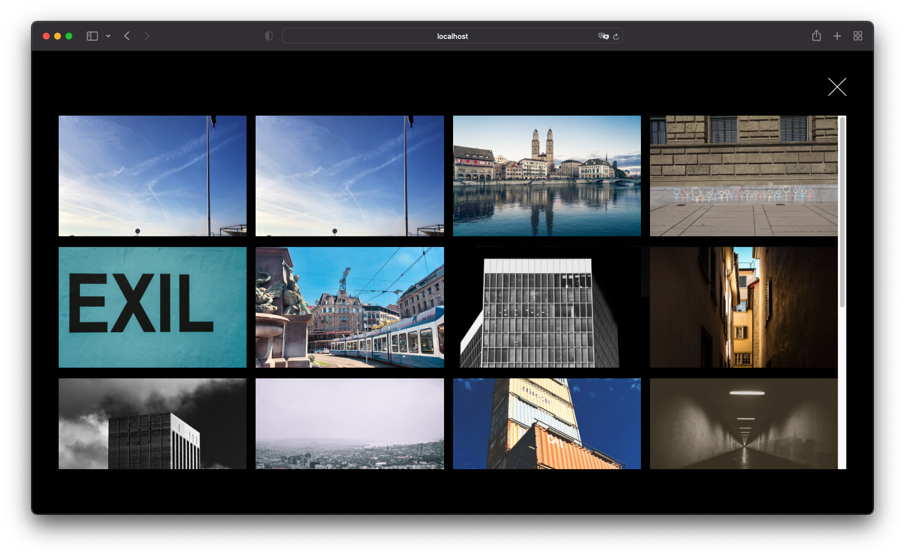
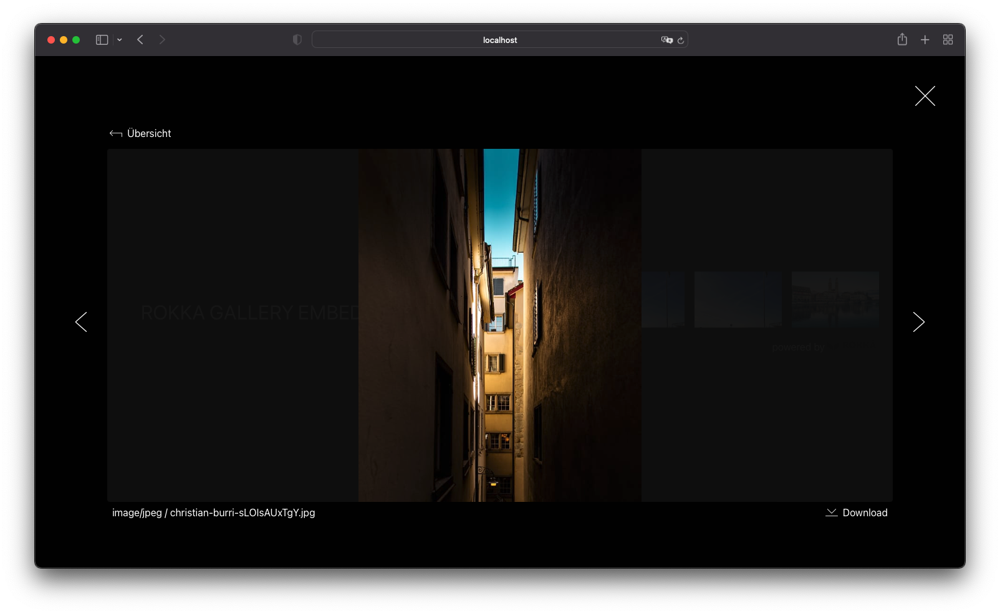

# Rokka Gallery Embed

|            Teaser             |             Overview              |             Carousel             |
|:-----------------------------:|:---------------------------------:|:--------------------------------:|
|  |  |  |

## Usage

To use the Rokka Gallery Embed on your site, embed it with

```html

<script
    src="/rokka-gallery.js"
    data-lang="de"
    data-organization="your-organization"
    data-album="your-album"
></script>
```

You can either build the project yourself
and host the script on your site, or use a CDN.

### Languages

| Language |          Code         |
|:--------:|:---------------------:|
| English  | `en` (Default option) |
| German   | `de`                  |

### API

We provide the following events on the document

- `rokkagallery.open` is triggered when the Overlay is opened
- `rokkagallery.close` is triggered when the Overlay is closed

```js
document.addEventListener('rokkagallery.open', rokkaOverlayOpened)
document.addEventListener('rokkagallery.close', rokkaOverlayClosed)
```

You may wish to restrict scrolling or tabbing on your page while the user has opened Rokka Gallery.

## Development

Clone the repository, and install all dependencies with `npm i`.

Preview the project with `npm run dev`.
Be careful with this, as some styles may get overwritten by the 'host' page, so building is more often the safer option.

Lint the project before committing with `npm run lint`.

### Build

Build the Rokka Gallery Embed project with `npm run build`.
The output file is located at `dist/rokka-gallery.js`.
