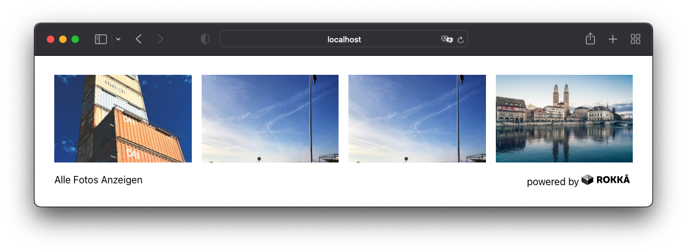

# Rokka Gallery Embed

|            Teaser             |             Overview              |             Carousel             |
|:-----------------------------:|:---------------------------------:|:--------------------------------:|
|  |  |  |

## Usage

You can embed any rokka gallery in your site with the following snippet:

```html
<script
  async
  src="https://embed.rokka.io/v1/rokka-gallery.js"
  data-lang="de"
  data-organization="your-organization"
  data-album="your-album"
></script>
```

You can either build the project yourself
and host the script on your site, or use a CDN.

### Languages

| Language |          Code         |
|:--------:|:---------------------:|
| English  | `en` (Default option) |
| German   | `de`                  |

### Events

We provide the following events on the document

- `rokkagallery.open` is triggered when the overlay is opened
- `rokkagallery.close` is triggered when the overlay is closed

```js
document.addEventListener('rokkagallery.open', rokkaOverlayOpened)
document.addEventListener('rokkagallery.close', rokkaOverlayClosed)
```

For example, you can restrict scrolling or tabbing on your page while the user has Rokka Gallery open.

### Styles

You may wish to adjust the style of the embed on your page. We provide the following CSS properties on `:root`

|                       Property                      |             Default Value             |
|:---------------------------------------------------:|:-------------------------------------:|
|           `—rokka-gallery-overlay—z-index`          |                 `1000`                |
|          `—rokka-gallery-overlay—bg-color`          |          `rgb(0, 0, 0, 0.95)`         |
|         `—rokka-gallery-overlay—text-color`         |               `#ffffff`               |
|    `—rokka-gallery-carousel-image-item—bg-color`    |       `rgb(255, 255, 255, 0.05)`      |

## Development

Clone the repository, and install all dependencies with `npm i`.

Preview the project with `npm run dev`.
Be careful with this, as some styles may get overwritten by the 'host' page, so building is more often the safer option.

Lint the project before committing with `npm run lint`.

### Build

Build the Rokka Gallery Embed project with `npm run build`.
The output file is located at `dist/rokka-gallery.js`.
